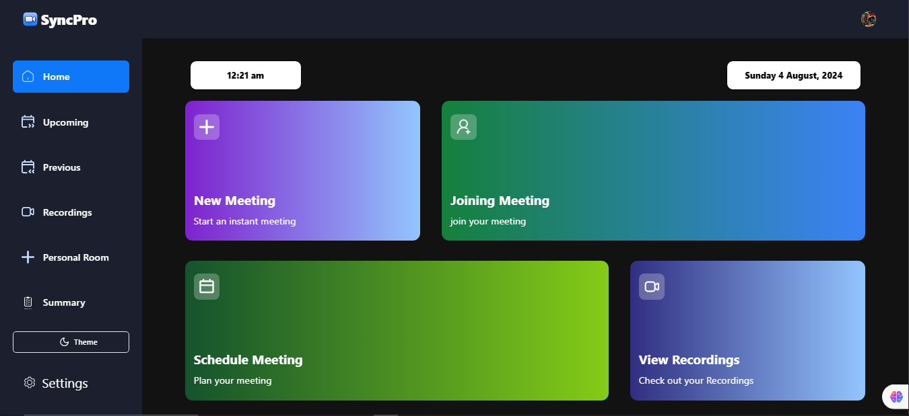
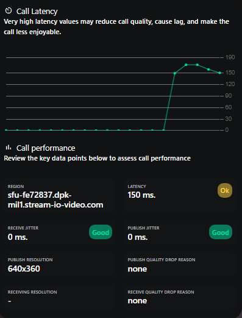

```
# SyncPro

SyncPro is a cutting-edge video conferencing and collaboration platform designed to make virtual meetings seamless and efficient. With features like instant meetings, scheduled sessions, and detailed call performance analytics, SyncPro is your go-to solution for remote communication needs.



## Features

- **Instant Meeting**: Start a meeting instantly with just a click.
- **Schedule Meeting**: Plan and organize your meetings in advance.
- **Join Meeting**: Easily join scheduled meetings with a single click.
- **View Recordings**: Access and manage your meeting recordings.
- **Call Performance Analytics**: Monitor your call quality with detailed latency and jitter information.
  
  

## Demo

Check out our live demo: [SyncPro](https://sync-pro.vercel.app/)

## Installation

1. Clone the repository:
   ```bash
   git clone https://github.com/AryaGupta01/SyncPro.git
   ```
2. Navigate to the project directory:
   ```bash
   cd syncpro
   ```
3. Install the dependencies:
   ```bash
   npm install
   ```
4. Run the application:
   ```bash
   npm start
   ```

## Usage

1. **New Meeting**: Navigate to the Home page and click "New Meeting" to start a session immediately.
2. **Join Meeting**: Click "Join Meeting" to enter a scheduled meeting.
3. **View Recordings**: Access your previous meetings' recordings by selecting "View Recordings" from the menu.
4. **Monitor Call Performance**: Go to the Summary section to view detailed analytics on your call quality.


## Contact

For any questions, please contact us at [support@syncpro.com](mailto:aryagupta101@gmail.com).

```